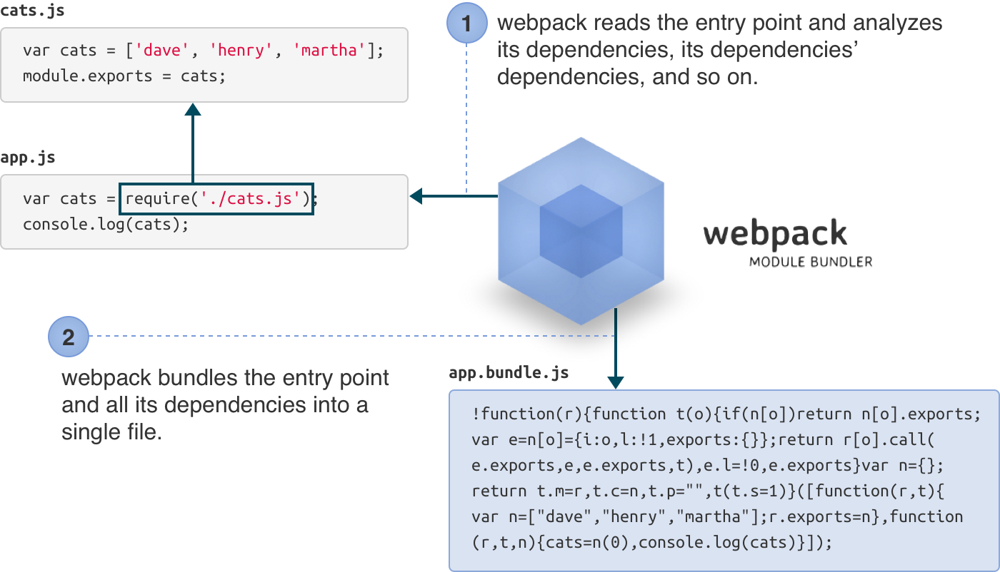

# Webpack 2

---

## What is Webpack?


---

## How It Works?

```bash
webpack src/app.js build/app.bundle.js
```



---

## Basic concepts

* Modules             <!-- .element: class="fragment" -->
* Dependency graph    <!-- .element: class="fragment" -->
* Loaders             <!-- .element: class="fragment" -->
* Entry               <!-- .element: class="fragment" -->
* Chunks              <!-- .element: class="fragment" -->
* Plugins             <!-- .element: class="fragment" -->
* Output              <!-- .element: class="fragment" -->

---

## What's new in Webpack 2

* Support ES6 modules           <!-- .element: class="fragment" -->
* Tree shaking                  <!-- .element: class="fragment" -->
* Environment profiles          <!-- .element: class="fragment" -->
* Enhanced resolver             <!-- .element: class="fragment" -->

---

## Project structure

* src/                <!-- .element: class="fragment" -->
* build/              <!-- .element: class="fragment" -->
* node_modules/       <!-- .element: class="fragment" -->
* webpack.config.js   <!-- .element: class="fragment" -->

---

## The simplest configuration

```JavaScript
// webpack.config.js
module.exports = {
  entry: './src/app.js',
  output: {
    path: __dirname + '/build',
    filename: 'bundle.js'
  }
};
```

```bash
webpack -p --progress
```

---

## Development Mode

```bash
webpack -d --watch

#  -d is the short-hand for
#    --debug 
#    --devtool eval-cheap-module-source-map
#    --output-pathinfo         
```

---

## Enable source map
```JavaScript
// webpack.config.js
module.exports = {
  entry: './src/app.js',
  output: {
    path: __dirname + '/build',
    filename: 'app.bundle.js'
  },
  devtool: 'eval-source-map'
};
```

---

## Webpack Dev Server
```bash
npm install -D webpack-dev-server
node_modules/.bin/webpack-dev-server --open
```

---

## Webpack Dev Server configuration
```JavaScript
// webpack.config.js
module.exports = {
  entry: './src/app.js',
  output: {
    path: __dirname + '/build',
    filename: 'app.bundle.js'
  },
  devtool: 'eval-source-map',
  devServer: {
    contentBase: __dirname + '/build',
    port: 8000,
    open: true,
    hot: true,
    compress: true,
    stats: 'errors-only'
  }
};
```

---

## Creating a mock API
```JavaScript
npm install -D npm-run-parallel
npm install -D json-server
```

```JavaScript
// package.json
...
  "scripts" : {
    "dev:server" : "webpack-dev-server",
    "dev:api" : "json-server ./src/db.json",
    "dev" : "npm-run-parallel dev:server dev:api"
  }
...
```

---

## HTML Webpack Plugin

Basic configuration
```bash
npm install -D html-webpack-plugin
```

```JavaScript
//webpack.config.js
var HtmlWebpackPlugin = require('html-webpack-plugin');
module.exports = {
  entry: './src/app.js',
  output: {
    path: __dirname + '/build',
    filename: 'app.bundle.js'
  },
  plugins: [new HtmlWebpackPlugin()]
};

```

---

## Configure HTML Webpack Plugin

Custom template
```JavaScript
//webpack.config.js
var HtmlWebpackPlugin = require('html-webpack-plugin');
module.exports = {
  entry: './src/app.js',
  output: {
    path: __dirname + '/build',
    filename: 'app.bundle.js'
  },
  plugins: [
    new HtmlWebpackPlugin({
      title: 'My Demo App',
      template: __dirname + '/src/index.ejs',
      filename: __dirname + '/build/index.html'
    })
  ]
};

```

---

## Environment Settings

```JavaScript
//webpack.config.js
modules.exports = (env) => {
  return {
    entry: './src/app.js',
    output: {
      path: __dirname + '/build',
      filename: 'app.bundle.js'
    },
    devtool: env.dev ? 'eval-source-map' : ''
  }
}
```

```bash
webpack --env.dev
```

---

## Tree Shaking

```JavaScript
// utils.js
export foo() {
  ...
}

export bar() {
  ...
}
```

```JavaScript
// app.js
import {foo} from './utils';
foo();
...
```

```bash
webpack -p
```

---

## Multiple Entries
```JavaScript
//webpack.config.js
...
    entry: {
      app: './src/app.js',
      contact: './src/contact.js'
    },
    output: {
      path: __dirname + '/build',
      filename: '[name].bundle.js'
    },
...
```

---

## Using chunkhash for long-term caching
```JavaScript
//webpack.config.js
...
    entry: {
      app: './src/app.js',
      contact: './src/contact.js'
    },
    output: {
      path: __dirname + '/build',
      filename: '[name]-[chunkhash].js'
    },
...
```

---

## Separating common modules for long-term caching
```JavaScript
//webpack.config.js
const webpack = require('webpack');
...
    entry: {
      app: './src/app.js'
    },
    output: {
      path: __dirname + '/build',
      filename: '[name]-[chunkhash].js'
    },
    plugins: [
      new webpack.optimize.CommonsChunkPlugin({
        name: 'common',
        filename: '[name]-[chunkhash].js'
      })
    ]
...
```

---

## Separating library modules for long-term caching
```JavaScript
//webpack.config.js
const webpack = require('webpack');
...
    entry: {
      app: './src/app.js',
      vendors: ['jquery', 'lodash']
    },
    output: {
      path: __dirname + '/build',
      filename: '[name]-[chunkhash].js'
    },
    plugins: [
      new webpack.optimize.CommonsChunkPlugin({
        names: ['common', 'vendors'],
        filename: '[name]-[chunkhash].js'
      })
    ],
...
```

---

## Lazy-loading ES6 modules

Dynamic import using ES6's System.import()
```JavaScript
// import users from './users';
//
// el.addEventListener('click', (event) => {
//   showUserDetails(users);
// });

el.addEventListener('click', (event) => {
  System
    .import('./users')
    .then((module) => {showUserDetails(module.default)});
});

```

---

## CSS-loader and Style-loader
```bash
npm install -D css-loader style-loader
```

```JavaScript
//webpack.config.js
...
    module: {
      loaders: [
        {test: /\.css$/, loader: 'style-loader!css-loader'}
      ]
    }
...
```

```JavaScript
//app.js
import './style.css';
```

---

## Sass-loader
```bash
npm install -D sass-loader
```

```JavaScript
//webpack.config.js
...
    module: {
      loaders: [
        {test: /\.css$/, loader: 'style-loader!css-loader'},
        {test: /\.scss$/, loader: 'style-loader!css-loader!sass-loader'}
      ]
    }
...
```

```JavaScript
//app.js
import './style.scss';
```

---

## Extracting inline CSS to external file
```bash
npm install -D extract-text-webpack-plugin@2.1
```

```JavaScript
//webpack.config.js
const ExtractTextPlugin = require('extract-text-webpack-plugin');
...
  module: {
    loaders: [
      { test: /\.css$/, 
        loader: ExtractTextPlugin.extract({
          fallback: 'style-loader',
          use: ['css-loader'],
          publicPath: '/build'
        })
      }]
  },
  plugins: [
    new ExtractTextPlugin({filename: 'styles.css', allChunks: true})
  ]
...
```

---

## Babel-loader for React.js
```bash
npm install -D babel-core babel-loader babel-polyfill
npm install -D babel-preset-es2015 babel-preset-react babel-preset-stage-0
npm install -s react react-dom
```

```JavaScript
//.babelrc
{
  "presets": ["es2015", "react", "stage-0"]
}
```

```JavaScript
//webpack.config.js
...
    loaders: [
      { test: /\.jsx$/, exclude: /node_modules/, loader: 'babel-loader' }
    ]
...
```

---

## Using Webpack API
```JavaScript
var webpack = require('webpack');
var conf = require(__dirname + '/webpack.config');
var compiler = webpack(conf);

compiler.watch(
  {
    aggregateTimeout: 300, // wait so long for more changes
    poll: true
  },
  function(err, stats) {
    if(err) {
      console.log(err);
      return;
    }
    console.log(stats.toString("normal"));
  }
)
```

---

## The End